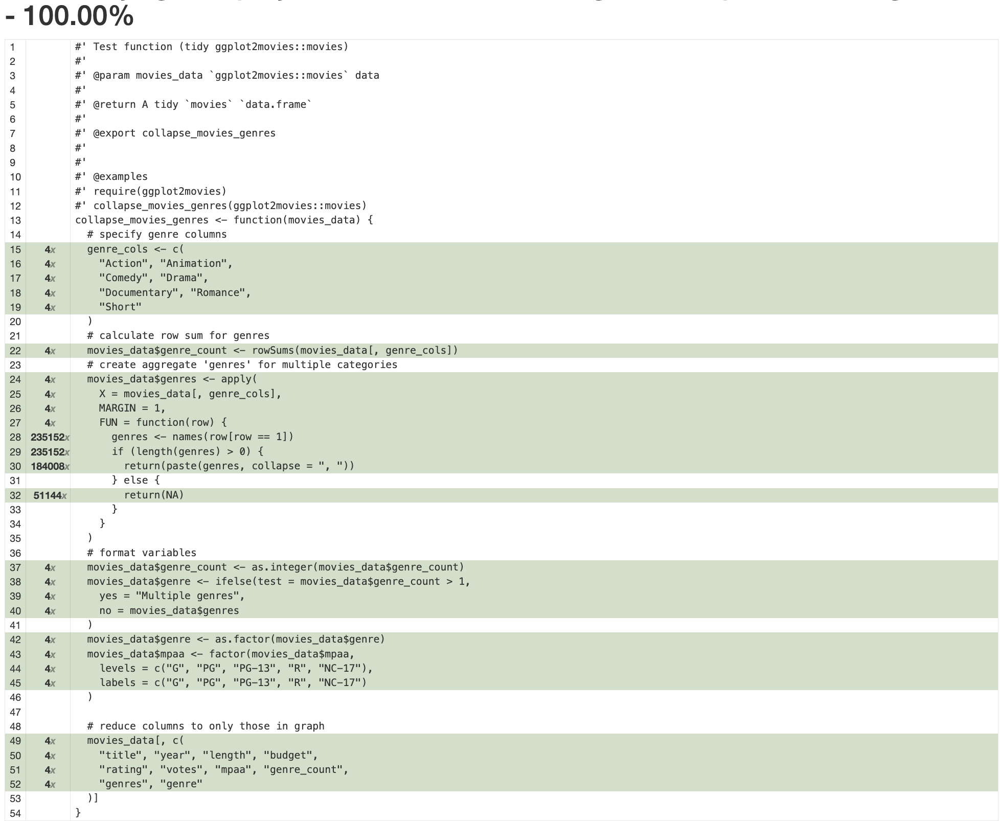
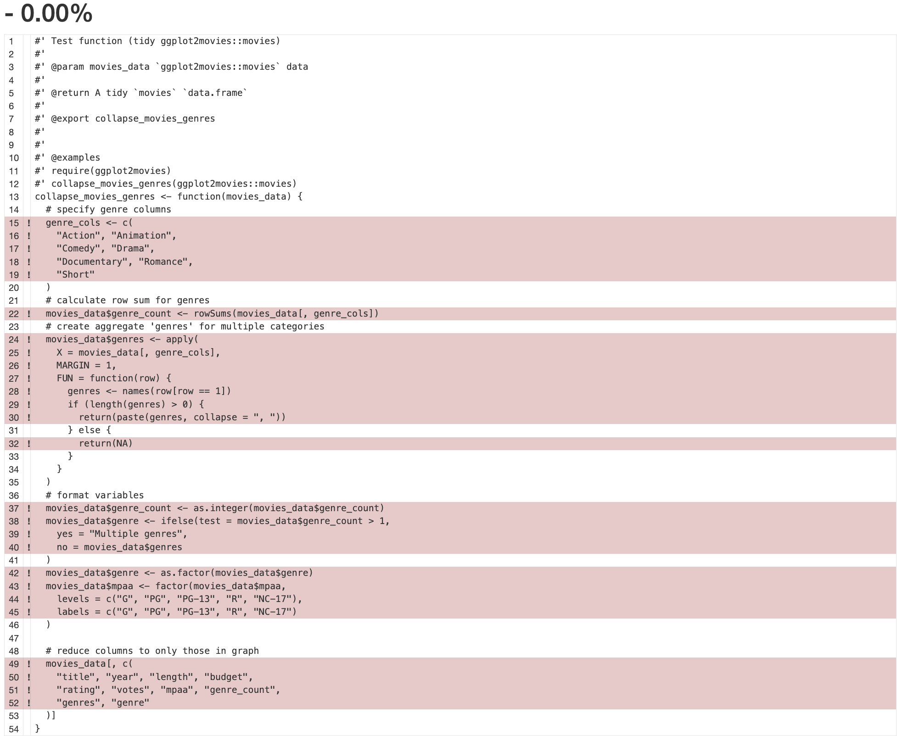
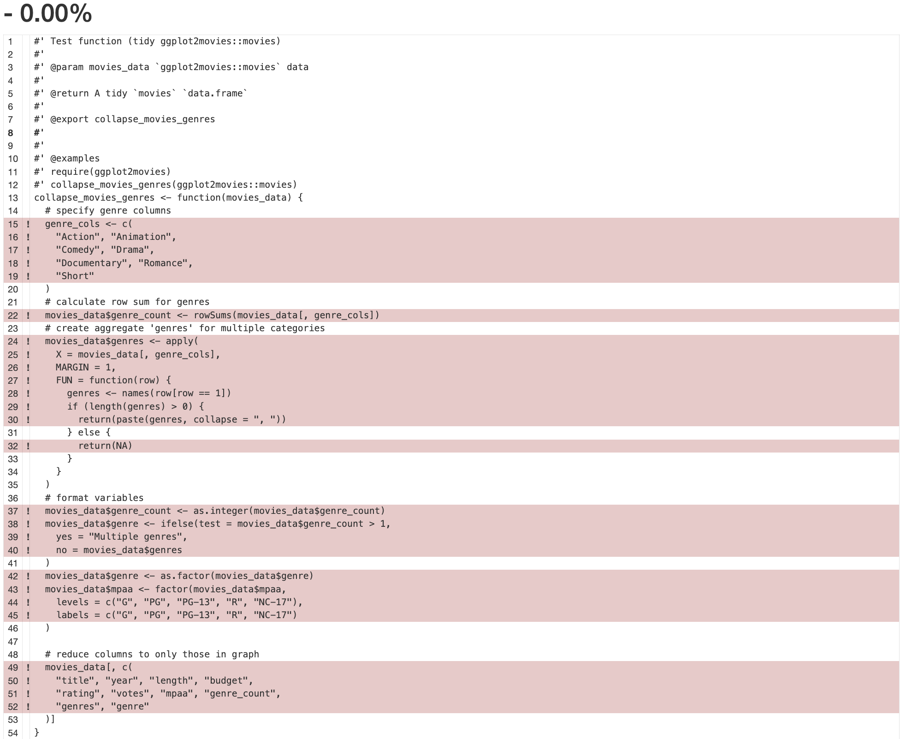

```{r setup, include=FALSE, echo=FALSE}
knitr::opts_chunk$set(
  echo = TRUE,
  collapse = TRUE,
  comment = "#>")
```

A small package for testing [`testthat`'s BDD functions](https://testthat.r-lib.org/reference/describe.html). 

## Example

```r
install.packages('pak')
library(pak)
# install devtools/usethis and ggplot2movies
pak::pak('devtools')
```

## Package structure 

```{verbatim, eval=FALSE}
├── DESCRIPTION
├── LICENSE
├── LICENSE.md
├── NAMESPACE
├── NEWS.md
├── R
│   ├── bddtestcoverage-package.R <- imports ggplot2movies::movies 
│   ├── collapse_movies_genres.R
│   └── data.R
├── README.Rmd
├── README.md
├── bddtestcoverage.Rproj
├── data
│   └── movies.rda     <- local version of ggplot2movies::movies
├── data-raw
│   └── movies.R       <- downloads/stores .csv version of ggplot2movies::movies 
├── inst
│   └── extdata
│       └── movies.csv <- .csv version of ggplot2movies::movies 
├── man
│   ├── bddtestcoverage-package.Rd
│   └── collapse_movies_genres.Rd
└── tests
    ├── testthat
    │   ├── fixtures
    │   │   ├── make_test_data.R <- takes sample from ggplot2movies::movies 
    │   │   └── test_data.rds    <- sample from ggplot2movies::movies 
    │   ├── helper.R             <- contains test_logger() helper function 
    │   └── test-collapse_movies_genres.R
    └── testthat.R

10 directories, 21 files
```

## Using `collapse_movies_genres()`

`collapse_movies_genres()` collapses the genre columns in the `ggplot2movies::movies` data into a `genre_count` column, a single `genres` column (with all genres separated by commas), a `genre` factor column with either the single genre or `Multiple genres`. 

```{r}
library(bddtestcoverage)
movie_genres <- collapse_movies_genres(ggplot2movies::movies)
str(movie_genres)
```

```{r}
head(movie_genres[c('genre_count', 'genres', 'genre')])
```

# Tests 

```{verbatim, eval=FALSE}
tests
 └── tests
      ├── testthat
      │   ├── fixtures
      │   │   ├── make_test_data.R <- takes sample from ggplot2movies::movies 
      │   │   └── test_data.rds    <- sample from ggplot2movies::movies 
      │   ├── helper.R             <- contains test_logger() helper function 
      │   └── test-collapse_movies_genres.R
      └── testthat.R
```


The test file (`test-collapse_movies_genres.R`) contains the following tests: 

## Tests using helpers

```{r , eval=FALSE}
# The tests below use the helper from tests/testthat/helper.R
describe("Feature: (As a ..., In order to ..., I want to ...)", {
    it("Scenario: (Given ... , When ..., Then ...)", {
      test_logger(start = "helper", msg = "inside describe(it())")
        movie_genres <- collapse_movies_genres(ggplot2movies::movies)
        expect_true(is.factor(movie_genres$mpaa))
        test_logger(end = "helper", msg = "inside describe(it())")
      })
  })

describe("Feature: (As a ..., In order to ..., I want to ...)", {
  test_logger(start = "helper", msg = "inside describe()")
  describe("Background (Given ...)", {
          it("Scenario: (Given ... , When ..., Then ...)", {
          movie_genres <- collapse_movies_genres(ggplot2movies::movies)
          expect_true(is.factor(movie_genres$mpaa))
        })
    })
  test_logger(end = "helper", msg = "inside describe()")
})

describe("Feature: (As a ..., In order to ..., I want to ...)", {
  describe("Background (Given ...)", {
    test_logger(start = "helper", msg = "inside describe(describe())")
          it("Scenario: (Given ... , When ..., Then ...)", {
          movie_genres <- collapse_movies_genres(ggplot2movies::movies)
          expect_true(is.factor(movie_genres$mpaa))
        })
    test_logger(end = "helper", msg = "inside describe(describe())")
    })
})

describe("Feature: (As a ..., In order to ..., I want to ...)", {
  describe("Background (Given ...)", {
      it("Scenario: (Given ... , When ..., Then ...)", {
          test_logger(start = "helper", msg = "inside describe(describe(it()))")
          movie_genres <- collapse_movies_genres(ggplot2movies::movies)
          expect_true(is.factor(movie_genres$mpaa))
          test_logger(end = "helper", msg = "inside describe(describe(it()))")
        })
    })
})
```

These tests all pass (and the helper is loaded with `devtools:::test_active_file()`).

```
devtools:::test_active_file()
[ FAIL 0 | WARN 0 | SKIP 0 | PASS 0 ]
INFO [2023-10-31 06:42:20] [ START helper = inside describe(it())]
[ FAIL 0 | WARN 0 | SKIP 0 | PASS 1 ]
INFO [2023-10-31 06:42:20] [ END helper = inside describe(it())]

INFO [2023-10-31 06:42:20] [ START helper = inside describe()]
[ FAIL 0 | WARN 0 | SKIP 0 | PASS 2 ]
INFO [2023-10-31 06:42:21] [ END helper = inside describe()]

INFO [2023-10-31 06:42:21] [ START helper = inside describe(describe())]
[ FAIL 0 | WARN 0 | SKIP 0 | PASS 3 ]
INFO [2023-10-31 06:42:21] [ END helper = inside describe(describe())]

INFO [2023-10-31 06:42:21] [ START helper = inside describe(describe(it()))]
[ FAIL 0 | WARN 0 | SKIP 0 | PASS 4 ]
INFO [2023-10-31 06:42:22] [ END helper = inside describe(describe(it()))]
```

### Coverage 

```{r helper_coverage.png, echo=FALSE, out.width='90%', fig.align='center'}

```

## Tests using fixtures 

The tests below use the data from `tests/testthat/fixtures/test_data.rds`:

```{r , eval=FALSE}
# inside it() with single describe() 
describe("Feature: (As a ..., In order to ..., I want to ...)", {
    it("Scenario: (Given ... , When ..., Then ...)", {
        # load fixture
        test_data <- readRDS(file = test_path("fixtures", "test_data.rds"))
        movie_genres <- collapse_movies_genres(test_data)
        expect_true(is.factor(movie_genres$mpaa))
      })
  })
# inside it() with nested describe() 
describe("Feature: (As a ..., In order to ..., I want to ...)", {
  describe("Background (Given ...)", {
          it("Scenario: (Given ... , When ..., Then ...)", {
          # load fixture
          test_data <- readRDS(file = test_path("fixtures", "test_data.rds"))
          movie_genres <- collapse_movies_genres(test_data)
          expect_true(is.factor(movie_genres$mpaa))
        })
    })
})
```

These tests pass:

```
devtools:::test_active_file()
[ FAIL 0 | WARN 0 | SKIP 0 | PASS 2 ]
```

### Coverage

But the test coverage is 0.0%

```{r fixture_coverage.png, echo=FALSE, out.width='90%', fig.align='center'}

```

## Tests using helpers and fixtures

```{r, eval=FALSE}
describe("Feature: (As a ..., In order to ..., I want to ...)", {
  ## call helper ----
  test_logger(start = "helper/fixture", msg = "inside describe()")
      it("Scenario: (Given ... , When ..., Then ...)", {
          # load fixture
          test_data <- readRDS(file = test_path("fixtures", "test_data.rds"))
          movie_genres <- collapse_movies_genres(test_data)
          expect_true(is.factor(movie_genres$mpaa))
        })
  ## call helper ----
  test_logger(end = "helper/fixture", msg = "inside describe()")
})
describe("Feature: (As a ..., In order to ..., I want to ...)", {
      it("Scenario: (Given ... , When ..., Then ...)", {
          ## call helper ----
          test_logger(start = "helper/fixture", msg = "inside describe(it())")
          # load fixture
          test_data <- readRDS(file = test_path("fixtures", "test_data.rds"))
          movie_genres <- collapse_movies_genres(test_data)
          expect_true(is.factor(movie_genres$mpaa))
          ## call helper ----
          test_logger(end = "helper/fixture", msg = "inside describe(it())")
        })
})
describe("Feature: (As a ..., In order to ..., I want to ...)", {
    describe("Background (Given ...)", {
        test_that("Scenario: (Given ... , When ..., Then ...)", {
            ## call helper ----
            test_logger(start = "helper/fixture",
                        msg = "inside describe(describe(test_that()))")
            # load fixture
            test_data <- readRDS(file = test_path("fixtures", "test_data.rds"))
            movie_genres <- collapse_movies_genres(test_data)
            expect_true(is.factor(movie_genres$mpaa))
            ## call helper ----
            test_logger(end = "helper/fixture",
                        msg = "inside describe(describe(test_that()))")
          })
      })
  })
describe("Feature: (As a ..., In order to ..., I want to ...)", {
    describe("Background: (Given ...)", {
        it("Scenario: (Given ... , When ..., Then ...)", {
            ## call helper ----
            test_logger(start = "helper/fixture", 
                        msg = "inside describe(describe(it()))")
            ## load fixture ----
            test_data <- readRDS(file = test_path("fixtures", "test_data.rds"))
            movie_genres <- collapse_movies_genres(test_data)
            expect_true(is.factor(movie_genres$mpaa))
            ## call helper ----
            test_logger(end = "helper/fixture", 
                        msg = "inside describe(describe(it()))")
          })
      })
  })
```

These tests pass:

```
devtools:::test_active_file()
[ FAIL 0 | WARN 0 | SKIP 0 | PASS 0 ]
INFO [2023-10-31 07:03:53] [ START helper/fixture = inside describe()]
[ FAIL 0 | WARN 0 | SKIP 0 | PASS 1 ]
INFO [2023-10-31 07:03:53] [ END helper/fixture = inside describe()]

INFO [2023-10-31 07:03:53] [ START helper/fixture = inside describe(it())]
[ FAIL 0 | WARN 0 | SKIP 0 | PASS 2 ]
INFO [2023-10-31 07:03:53] [ END helper/fixture = inside describe(it())]

INFO [2023-10-31 07:03:53] [ START helper/fixture = inside describe(describe(test_that()))]
[ FAIL 0 | WARN 0 | SKIP 0 | PASS 3 ]
INFO [2023-10-31 07:03:53] [ END helper/fixture = inside describe(describe(test_that()))]

INFO [2023-10-31 07:03:53] [ START helper/fixture = inside describe(describe(it()))]
[ FAIL 0 | WARN 0 | SKIP 0 | PASS 4 ]
INFO [2023-10-31 07:03:53] [ END helper/fixture = inside describe(describe(it()))]
```

### Coverage 

But the test coverage is 0.0%

```{r fixture_helper_coverage.png, echo=FALSE, out.width='90%', fig.align='center'}

```

